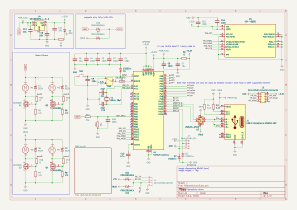
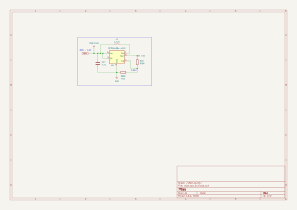

# Schematic Pictures

This folder contains the schematic diagrams for the Fiddle Sticks project.

> **Note:** GitHub may cache SVG images in README, so sometimes the displayed image might be outdated.  
> Clicking on the **raw link** below will always open the latest version.

---

## Block Diagram

[View Block Diagram (raw)](https://raw.githubusercontent.com/kushurox/fiddlesticks_pcb/main/schematic_pics/fiddlesticks.svg)

---

## Power Flow Diagram

[View Power Flow Diagram (raw)](https://raw.githubusercontent.com/kushurox/fiddlesticks_pcb/main/schematic_pics/fiddlesticks-VBAT_to_5V.svg)

---
